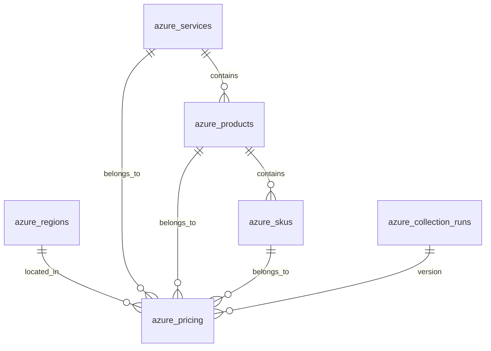

# Database Schema

CPC uses a normalized PostgreSQL schema designed for efficiency and scalability across multiple cloud providers.

## Schema Overview

The database is organized into logical groups:

### Core Tables
- `providers` - Cloud providers (AWS, Azure, GCP)
- `service_categories` - Service categorization
- `messages` - System messages/logs

### Azure-Specific Tables
- `azure_services` - Azure service catalog
- `azure_regions` - Azure geographic regions
- `azure_products` - Products within services
- `azure_skus` - SKU configurations
- `azure_pricing` - Main pricing data
- `azure_collection_runs` - Data collection metadata

## Table Relationships



## Detailed Schema

### azure_services
```sql
CREATE TABLE azure_services (
    id SERIAL PRIMARY KEY,
    service_name VARCHAR(255) NOT NULL UNIQUE,
    service_family VARCHAR(255),
    category_id INTEGER REFERENCES service_categories(id),
    created_at TIMESTAMP DEFAULT CURRENT_TIMESTAMP,
    updated_at TIMESTAMP DEFAULT CURRENT_TIMESTAMP
);
```

### azure_regions
```sql
CREATE TABLE azure_regions (
    id SERIAL PRIMARY KEY,
    arm_region_name VARCHAR(100) NOT NULL UNIQUE,
    display_name VARCHAR(255) NOT NULL,
    created_at TIMESTAMP DEFAULT CURRENT_TIMESTAMP
);
```

### azure_products
```sql
CREATE TABLE azure_products (
    id SERIAL PRIMARY KEY,
    service_id INTEGER NOT NULL REFERENCES azure_services(id),
    product_name VARCHAR(500) NOT NULL,
    product_id VARCHAR(255),
    created_at TIMESTAMP DEFAULT CURRENT_TIMESTAMP,
    UNIQUE(service_id, product_name)
);
```

### azure_skus
```sql
CREATE TABLE azure_skus (
    id SERIAL PRIMARY KEY,
    product_id INTEGER NOT NULL REFERENCES azure_products(id),
    sku_name VARCHAR(500) NOT NULL,
    sku_id VARCHAR(255),
    arm_sku_name VARCHAR(255),
    created_at TIMESTAMP DEFAULT CURRENT_TIMESTAMP,
    UNIQUE(product_id, sku_name)
);
```

### azure_pricing (Main Table)
```sql
CREATE TABLE azure_pricing (
    id BIGSERIAL PRIMARY KEY,
    service_id INTEGER NOT NULL REFERENCES azure_services(id),
    product_id INTEGER NOT NULL REFERENCES azure_products(id),
    sku_id INTEGER NOT NULL REFERENCES azure_skus(id),
    region_id INTEGER NOT NULL REFERENCES azure_regions(id),
    meter_id VARCHAR(100) NOT NULL,
    meter_name VARCHAR(500),
    retail_price DECIMAL(20,10),
    unit_price DECIMAL(20,10),
    tier_minimum_units DECIMAL(20,2),
    currency_code VARCHAR(3) DEFAULT 'USD',
    unit_of_measure VARCHAR(255),
    price_type VARCHAR(50),
    reservation_term VARCHAR(50),
    effective_start_date DATE,
    is_primary_meter_region BOOLEAN DEFAULT true,
    collection_version INTEGER NOT NULL,
    created_at TIMESTAMP DEFAULT CURRENT_TIMESTAMP
);
```

## Indexes

Key indexes for performance:

```sql
-- Composite index for deduplication
CREATE UNIQUE INDEX idx_azure_pricing_unique 
ON azure_pricing (service_id, product_id, sku_id, region_id, meter_id, effective_start_date);

-- Query performance indexes
CREATE INDEX idx_azure_pricing_service ON azure_pricing(service_id);
CREATE INDEX idx_azure_pricing_region ON azure_pricing(region_id);
CREATE INDEX idx_azure_pricing_collection ON azure_pricing(collection_version);
CREATE INDEX idx_azure_pricing_created_at ON azure_pricing(created_at);
```

## Data Integrity

### Constraints
- Foreign key relationships ensure referential integrity
- Unique constraints prevent duplicates
- NOT NULL constraints ensure required data

### Conflict Resolution
The pricing table uses `ON CONFLICT` to handle updates:
```sql
ON CONFLICT (service_id, product_id, sku_id, region_id, meter_id, effective_start_date) 
DO UPDATE SET 
  retail_price = EXCLUDED.retail_price,
  collection_version = EXCLUDED.collection_version
```

## Scaling Considerations

### Current Stats
- ~60 Azure services
- ~400 products  
- ~800 SKUs
- 1000+ pricing records per region
- Supports 71+ regions

### Performance
- Batch inserts (100 records per transaction)
- Indexed lookups
- Normalized structure reduces storage
- Collection versioning for data lineage