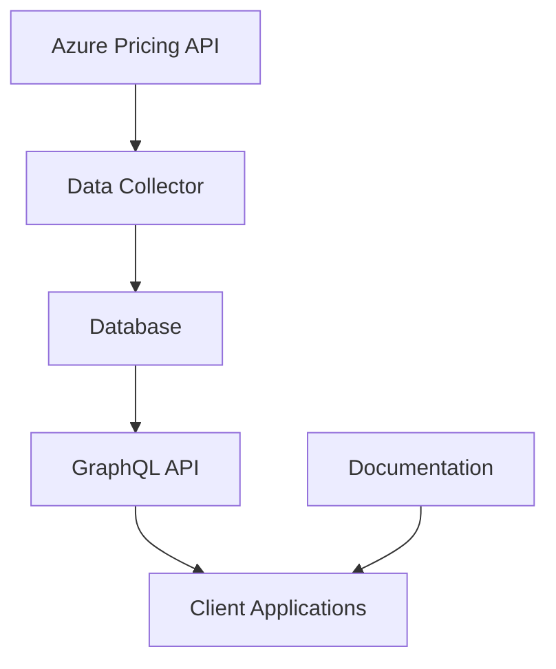

# Architecture Overview

CPC is designed as a scalable, production-ready API service for cloud pricing data aggregation and comparison.

## System Components

### 1. GraphQL API Server
- **Technology:** Go with custom GraphQL handler
- **Port:** 8080
- **Features:** Query processing, database integration, web playground

### 2. PostgreSQL Database
- **Technology:** PostgreSQL 15
- **Port:** 5432  
- **Schema:** Normalized relational design

### 3. Data Collection Pipeline
- **Azure Collector:** Fetches from Azure Retail Pricing API
- **Batch Processing:** Efficient bulk operations
- **Deduplication:** Prevents duplicate data

### 4. Documentation Site
- **Technology:** Docusaurus
- **Port:** 3000
- **Features:** API docs, architecture guides, tutorials

## Data Flow

## Key Design Principles

### Normalization
Data is stored in normalized tables to:
- Eliminate redundancy
- Ensure data consistency
- Enable efficient queries
- Support multiple cloud providers

### Scalability
- Batch processing for large datasets
- Indexed database queries
- Stateless API design
- Docker containerization

### Reliability
- Transaction-based data operations
- Error handling and recovery
- Data versioning
- Health checks

## Technology Stack

| Component | Technology | Purpose |
|-----------|------------|---------|
| API Server | Go | High-performance API |
| Database | PostgreSQL | Relational data storage |
| Documentation | Docusaurus | API documentation |
| Containerization | Docker | Environment consistency |
| Data Format | JSON | API communication |
| Query Language | GraphQL | Flexible queries |

## Future Architecture

Planned enhancements:
- Microservices architecture
- Caching layer (Redis)
- Message queue (RabbitMQ)
- Load balancing
- API authentication
- Multi-cloud support